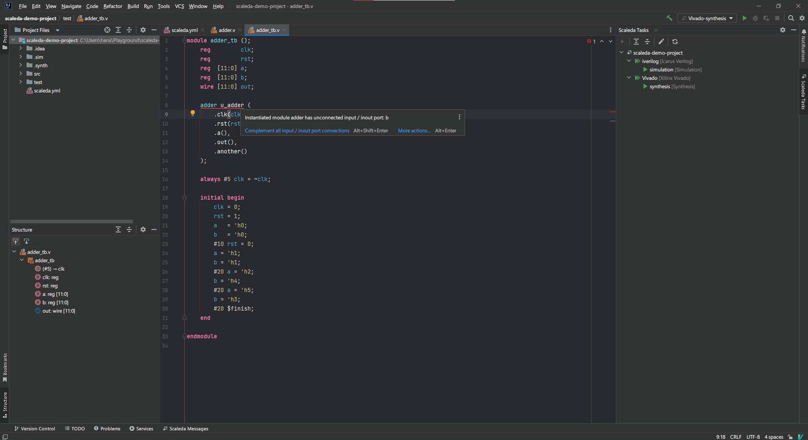

# Scaleda 综述

Scaleda（=Scalable + EDA）是一款用于 FPGA（Verilog）开发的集成开发环境。
它致力于提供用户友好的开发平台，支持智能化的 Verilog 代码编写及便捷的仿真调试体验，并可接入 Vivado 等厂商工具链实现逻辑综合、实现等功能。

Scaleda 基于 IntelliJ 平台，是 IntelliJ IDEA 上的一款插件。
用户可以在安装社区版 IDEA 后，安装 Scaleda 插件来使用它。
简而言之，Scaleda 目前是 IDEA 上的一款集 Verilog 语法及语义提示、FPGA EDA 工具链管理与调用、FPGA 项目管理的插件。

Scaleda 的开发背景来源于我们对 FPGA 开发教学普及情况的观察。
传统的 FPGA 开发围绕厂商提供的 EDA 软件进行。
然而，这类 EDA 软件如 Vivado 通常比较笨重，并且实际开发体验较差。
一些用户会选择使用 Visual Studio Code 并配合多个插件进行开发，但这种方式通常配置麻烦，对初学者并不友好，且实际体验参差不齐。
基于对这些问题的考虑，我们希望设计一个灵活、通用的 FPGA 开发平台。Scaleda 的开发愿景便是提供：

- 简便而直观的配置，开箱即用的体验。在需要用户设置软件功能时，提供图形界面与详细介绍。
- 用户友好的开发体验。用户在编写代码时，应有实时的语法及语义检查，并能针对常见问题给予修正提示。
- 良好的可拓展性。项目配置等文件采用通用文本格式，便于合作开发，也便于软件移植。
- 
Scaleda 是在 IntelliJ 平台上运行的。
尽管 IntelliJ IDEA 是一个被设计用于 Java 开发的 IDE，但其强大的 API 扩展系统使得我们可以在其之上增加对其他语言的支持，这一点与 Visual Studio Code 是类似的。
而相比之下，IDEA 更容易实现为「开箱即用」的开发环境，相比 Visual Studio Code 对用户来说配置更加简单，这也是我们选择它的原因。

## 功能展示

### 项目管理

Scaleda 支持创建、打开、保存和管理自有格式的 FPGA 项目。
这套项目系统支持在同一个项目中指定不同的「任务」（如仿真、综合），每个任务可以有不同的顶层模块，可以在不同的平台（如 Xilinx Vivado）上执行，并提供了基本的调试功能。
此外，Scaleda 也可以直接打开 Xilinx Vivado 项目，编辑其中的代码，甚至调用 Vivado 的综合、实现等任务。
[点击此处](./PROJECT.md)查看更多关于项目管理的介绍。

### 语义级补全

Scaleda 会根据您当前代码的上下文，自动给出合适的候选提示项。
例如：

- 当您正在写模块端口列表时，会自动补全 input 或 output 一类的关键词，也能在您想要填写位宽时提示模块级参数。
- 当您正在写表达式时，会自动补全可用的信号列表。

### 信号类型提示

代码中所有的信号会根据它们的类型使用不同的字体表示。
例如，所有紫色斜体表示「线网」类型，而紫色正体表示「寄存器（reg）」类型。
您可以将鼠标移动到某个信号上，浮窗会展示此信号的定义。
您也可以按住 Ctrl 点击以跳转到那个信号的定义处。

同样的提示也应用于模块的实例化上。
您可以轻松地通过浮窗查看某个被实例化的模块的原始模块头（即定义了模块参数和模块端口的部分），跳转到模块定义，或是查看某一个端口和参数的属性。

### 问题代码提示

Scaleda 会根据您的代码，给出可能的问题提示，例如多驱动、未使用的信号等。

### 代码格式化

Scaleda 支持格式化 Verilog 代码。
一方面，得益于 IntelliJ 平台的强大支持，Scaleda 可以在编写代码时自动调整缩进、空格等格式。
另一方面，Scaleda 也提供了格式化代码的功能，您可以在编辑器中选中一段代码，按下 Ctrl + Alt + L（或者在菜单栏中选择 Code -> Reformat Code）来格式化代码。
这部分功能是由 Verible 实现的。

## 下一步开发

本项目的初步目标，是通过提供良好的用户体验，帮助初学者更好地了解、入门 FPGA 及至数字逻辑的世界。
为实现这一目标，我们在 IntelliJ IDEA 平台上实现了一些智能化的 Verilog 编辑功能。
对于已熟悉 EDA 工具使用的用户，可以把 Scaleda 作为一个增强型的编辑器使用；而对于零基础的初学者，实时的代码提示器更能帮助他们养成良好的编码习惯。
不过，我们的编辑器实现也并不完美，除了存在一些体验 bug 外，还需要增加更多的代码问题检测功能。

本项目的更深层次的目标，是建立一套在厂商 EDA 之上的开发流，用户不再直接与厂商 EDA 交互，而由 Scaleda 调用工具链完成功能。
我们设计了自己的项目系统，接入了两款工具链，并提供了非常简单的 IP 实现。
这套系统仍然有许多完善空间，包括采用开放标准的中间格式、直观的中间提示、支持更多的工具链、更加完善的错误处理等。
同时，一些功能已有设计但存在很多问题而未在本文档中展示，如远程工具链的使用等。这些问题需要更多的开发去解决，部分原有设计也需要进行优化。