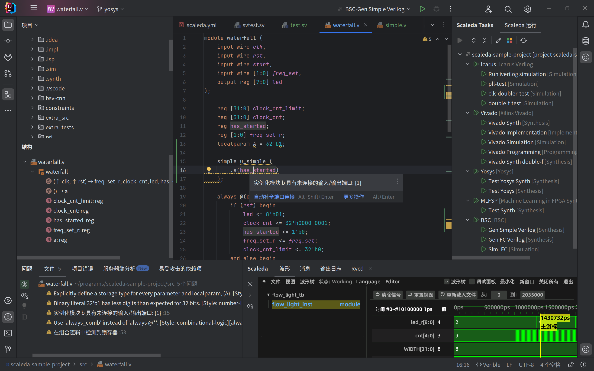

Scaleda 文档
===================================

Scaleda 是 IntelliJ 平台上的 ASIC & FPGA 开发扩展，提供多种 HDL 语言支持、项目管理、多种工具链组合调用等功能。

.. image:: https://img.shields.io/jetbrains/plugin/d/21863?color=%2315559aff
   :target: https://plugins.jetbrains.com/plugin/21863
.. image:: https://readthedocs.org/projects/scaleda/badge/?version=latest
   :target: https://scaleda.readthedocs.io/zh-cn/latest/?badge=latest
   :alt: Documentation Status
.. image:: https://img.shields.io/badge/document-online-blue
   :target: https://scaleda.top
   :alt: Online Documentation

主要功能介绍请查看文档 :doc:`introduction`。

开始使用请查看 → 💫 :doc:`manual/quick-start` 💫 ←

.. toctree::
   :maxdepth: 1
   :caption: 文档

   introduction
   installation
   manual/index
   build
   about
   README

API
==================

.. toctree::
   :caption: API 文档

   api
