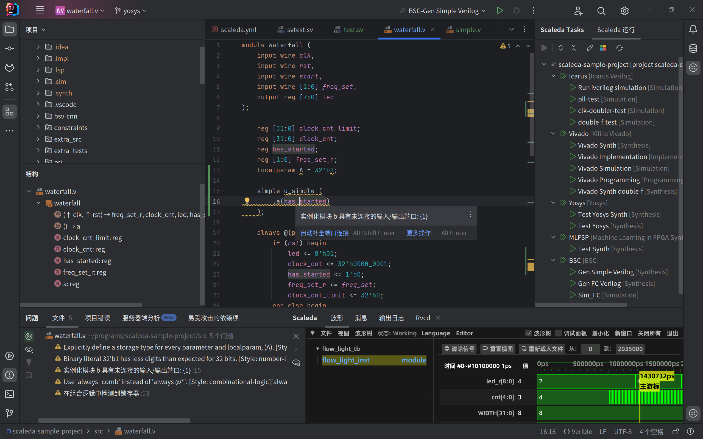
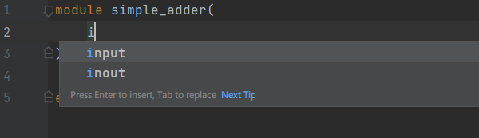
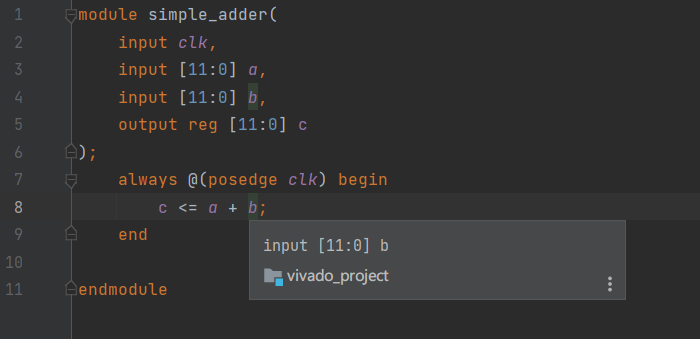
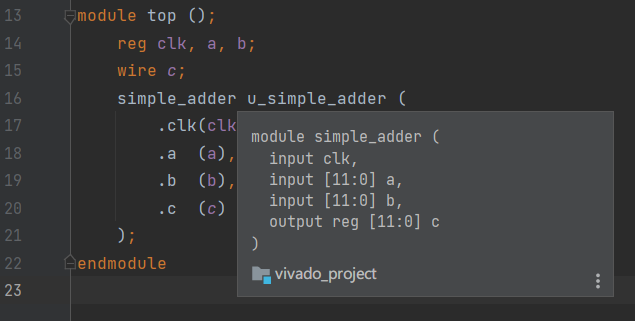
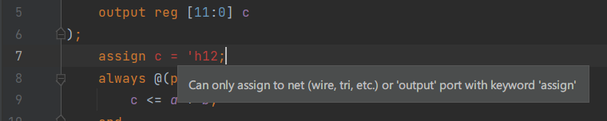
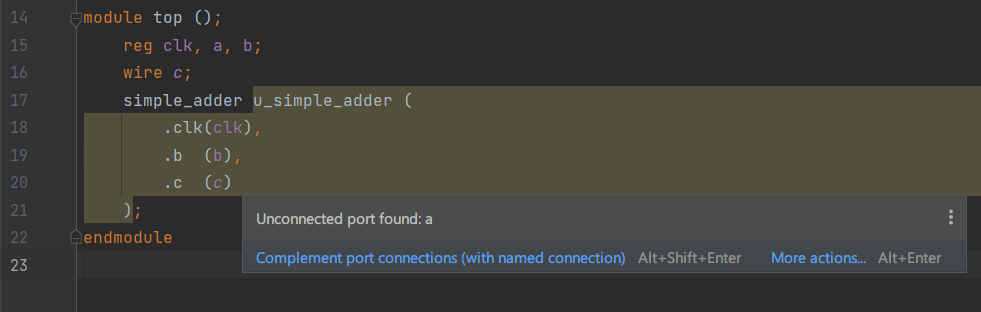
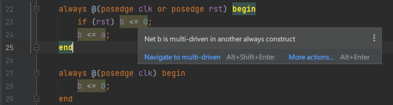

# Scaleda 项目综述

Scaleda（=Scalable + EDA）是一个 IntelliJ 平台的可扩展 FPGA EDA 辅助工具，具有 HDL 项目管理、HDL 语言支持、FPGA 工具调用等功能，是一款用于 FPGA（Verilog）开发的集成开发环境，致力于提供用户友好的开发平台，支持智能化的 Verilog 代码编写及便捷的仿真调试体验。
目前，Scaleda 已支持的功能包括：

 - Verilog 语言的基本语法功能（语法高亮、代码折叠、代码格式化、代码注释、代码导航等）；
 - Verilog 语言的简单代码补全；
 - Verilog 语言的代码检查（语法错误与语义错误，以及诸如端口缺失、多驱动等错误）；
 - 使用 [Verible](https://github.com/chipsalliance/verible) 的 Verilog、SystemVerilog 代码格式化；
 - Verilog、SystemVerilog、Tcl、Bluespec SystemVerilog 语法解析高亮；
 - 自有项目和 IP 结构，支持调用 Vivado、Quartus Prime、iverilog、Yosys 等工具进行仿真、综合、实现等操作；
 - 支持加载 Vivado 工程并调用其中的综合、实现等操作；
 - 内置波形查看器 [Rvcd](https://github.com/Scaleda/rvcd)、[Surfer](https://gitlab.com/surfer-project/surfer)；
 - 运行服务器模式以执行远程 EDA 任务；
 - Verible、[Svls](https://github.com/dalance/svls)或自定义语言服务器（LSP）支持；
 - 国际化多显示语言支持；

Scaleda 的开发背景来源于我们对 FPGA 开发教学普及情况的观察。
传统的 FPGA 开发围绕厂商提供的 EDA 软件进行。
然而，这类 EDA 软件如 Vivado 通常比较笨重，并且实际开发体验较差。
一些用户会选择使用 Visual Studio Code 并配合多个插件进行开发，但这种方式通常配置麻烦，对初学者并不友好，且实际体验参差不齐。
基于对这些问题的考虑，我们希望设计一个灵活、通用的 FPGA 开发平台。Scaleda 的开发愿景便是提供：

- 简便而直观的配置，开箱即用的体验。在需要用户设置软件功能时，提供图形界面与详细介绍。
- 用户友好的开发体验。用户在编写代码时，应有实时的语法及语义检查，并能针对常见问题给予修正提示。
- 基于文本的项目管理。通过文本格式的项目配置管理和生成其他工具链项目，方便多人协作和版本控制。
- 丰富的功能。除了基本的代码编辑功能外，还应提供仿真、综合、实现等功能，以及波形查看器等辅助功能。
- 开源工具链支持。充分发挥开源生态的灵活性，在 FPGA 开发中组合使用多种开源工具。

Scaleda 是在 IntelliJ 平台上运行的。
尽管 IntelliJ IDEA 是一个被设计用于 Java 开发的 IDE，但其强大的 API 扩展系统使得我们可以在其之上增加对其他语言的支持，这一点与 Visual Studio Code 是类似的。
与 Visual Studio Code 相比，IntelliJ IDEA 语言支持开发更规范化，更容易实现为“开箱即用”的开发环境，对用户来说配置更加简单。

## 部分功能简介

请点击各部分标题以查看详细介绍。

### [项目管理](manual/project.md)

Scaleda 支持创建、打开、保存和管理自有格式的 FPGA 项目。
这套项目系统支持在同一个项目中，为不同的“目标平台”（如 Xilinx Vivado、Quartus Prime）指定不同的“任务”（如仿真、综合），每个任务可以有不同的顶层模块等配置参数，做到同一套 HDL 代码的跨目标平台开发。
此外，Scaleda 也可以直接打开 Xilinx Vivado 项目，编辑其中的代码，甚至调用 Vivado 的综合、实现等任务。

### HDL 语言支持

#### 语义级补全

Scaleda 会根据您当前代码的上下文，自动给出合适的候选提示项。
例如：

- 当您正在写模块端口列表时，会自动补全 input 或 output 一类的关键词，也能在您想要填写位宽时提示模块级参数。
- 当您正在写表达式时，会自动补全可用的信号列表。

当前自动补全仅在内部支持了 Verilog 语言，需要更多补全功能请使用支持代码补全的语言服务器。

#### 信号类型提示

代码中所有的信号会根据它们的类型使用不同的字体表示。
例如，所有紫色斜体表示“线网”类型，而紫色正体表示“寄存器（reg）”类型。
您可以将鼠标移动到某个信号上，浮窗会展示此信号的定义。
您也可以按住 Ctrl 点击以跳转到那个信号的定义处。

同样的提示也应用于模块的实例化上。
您可以轻松地通过浮窗查看某个被实例化的模块的原始模块头（即定义了模块参数和模块端口的部分），跳转到模块定义，或是查看某一个端口和参数的属性。

#### 问题代码提示

Scaleda 会根据您的代码，给出可能的问题提示，例如多驱动、未使用的信号等。

除了 Scaleda 内置的代码检查，语言服务器提供的代码检查也会一并显示。

#### 代码格式化

目前 Scaleda 的 Verilog 代码格式化功能是通过 [Verible Formatter](https://github.com/chipsalliance/verible/tree/master/verilog/tools/formatter) 实现的，支持 Verilog 和 SystemVerilog 代码的格式化，并支持自定义格式化选项。
通过 IDEA PSI 实现的格式化尚在开发中。

### IP 核管理

Scaleda 通过项目配置实现了 IP 核管理功能，通过嵌套的项目配置文件，可以将 Scaleda 项目导出为 IP 核，并提供用户界面进行参数编辑，以供其他项目快速导入使用。
同时，Scaleda 也支持添加 FPGA 厂商提供的 IP 核，以供用户在特定平台上使用。

### 工具链调用

通过 Scaleda 的项目配置，可以调用 Vivado、Quartus Prime、iverilog、Yosys 等工具链进行仿真、综合、实现等操作。
Scaleda 内置了对这些工具链的预设处理，以快速生成对应平台的项目或仿真文件等，并提供调用过程中的消息解析和错误修正建议。

不想使用 Scaleda 项目系统的用户，也可以在 IDEA 中直接打开 Vivado 项目，解析路径引用、直接调用生成任务等。

### 远程服务支持

Scaleda 支持在服务器模式下运行，以执行远程 EDA 任务，提供简单的 JWT 认证机制，支持多用户同时使用。
执行远程任务时，Scaleda 会将任务提交到服务器，服务器会调用相应的工具链执行任务，并实时将结果返回给客户端。

### 命令行工具

Scaleda 的大部分核心功能都可以在命令行中使用，如执行本地和远程执行任务、作为服务器运行等。

### 波形工具

Scaleda 内置了多个开箱即用的波形查看器，并提供基于语法解析的网表-波形匹配跳转功能。

## 下一步

本项目的初步目标，是通过提供良好的用户体验，帮助初学者更好地了解、入门 FPGA 及至数字逻辑的世界。
为实现这一目标，我们在 IntelliJ IDEA 平台上实现了一些智能化的 Verilog 编辑功能，并支持了基本的项目管理、工具链调用等功能。

在未来，我们希望 Scaleda 能够支持更多的工具链、更多的功能，以及更好的用户体验。

计划中的功能 <del>大饼</del> 包括：

- Chisel、SpinalHDL 功能增强；
- 网表查看器；
- HDL 文档生成；
- HDL 全局索引；
- HDL 代码格式转换；
- 逻辑分析仪；
- ……

计划修正的问题、功能增强等请查看 Issues。

Scaleda 已完全开源在 [GitHub](https://github.com/Scaleda/Scaleda)，欢迎您参与贡献代码，在 [Issues](https://github.com/Scaleda/Scaleda/issues) 中提出建议和功能需求、报告问题。

目前 Scaleda 仅有两名开发者，我们希望能够得到更多的用户反馈，以帮助我们更好地改进 Scaleda。
由于开发者目前都是计算机专业的学生，数字电路设计方面的知识有限。
如果您希望为 Scaleda 贡献代码，我们为您在阅读代码时造成的精神损害提供真挚的歉意。
