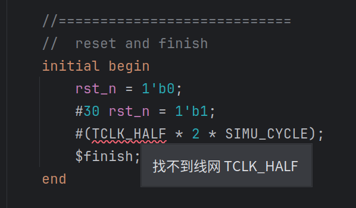
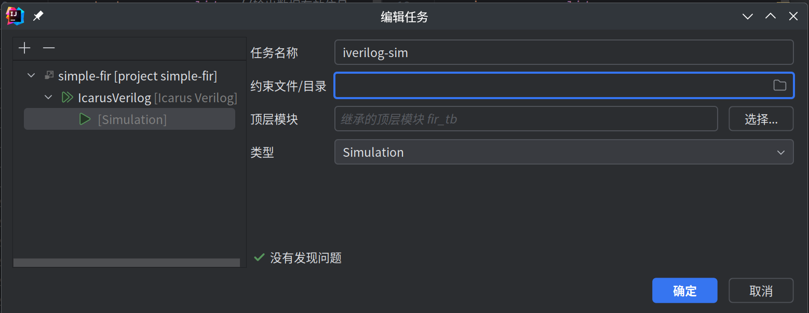
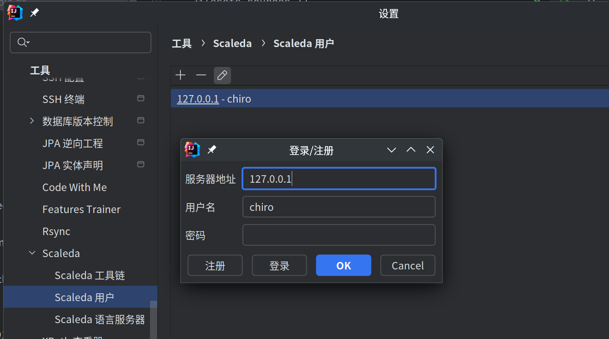

# 快速开始

本文档将引导您快速开始使用 Scaleda。

## 安装

[](https://plugins.jetbrains.com/plugin/21863)

**💥注意**：目前 Scaleda 还未与其他支持 HDL 语言的插件验证兼容性，暂时不要同时安装使用其他 HDL 语言支持插件。

参考文档 [安装 Scaleda](../installation.md)。

## 创建项目

### 创建新项目

文件 → 新建 → 项目 → Scaleda。此处两个参数详见 [项目管理](project.md)，此处保持默认即可。


如果在“项目”下没有 Scaleda，可以在 文件 → 新建 → 项目 → 生成器 下的 “Scaleda模块” 中创建项目，也可以使用命令行工具。


此时创建了两个空文件夹以及项目配置文件 `scaleda.yml`，内容如下：

```yaml
---
name: simple-fir
type: rtl
source: src
test: test
```

### 从已有代码创建项目

如果您已有 HDL 代码，可以直接新建 `scaleda.yml` 文件，按照 [项目管理](project.md) 为项目配置路径参数等。

## 编写 HDL 代码

在 `src` 文件夹右击 → 新建 → Verilog 文件。输入模块名称 `fir` 以创建 `fir.v` 文件。
在 `test` 文件夹右击 → 新建 → Verilog 文件。输入测试文件名称 `fir_tb` 以创建对应的仿真 testbench。


打开支持的文件时，如果您使用的是付费版本的 IDEA，语言服务器将会启动。点击右下角可以查看语言服务器的状态，或重新启动语言服务器。当切换运行配置时，语言服务器会自动重新加载文件列表等信息。


在 设置 → 工具 → Scaleda → Scaleda 语言服务器 中，您可以调整或切换内置的语言服务器，或设置自定义的语言服务器。


编辑 HDL 代码时，可以使用由语言服务器和 Scaleda 内置逻辑提供的代码补全、语法检查等功能。

目前内置的 HDL 语言支持尚有不完善之处，如果遇到了语法解析错误或代码检查错误的情况，欢迎您在 [GitHub Issues](https://github.com/Scaleda/Scaleda/issues) 中提出。



Scaleda 通过 Verible 提供了 Verilog / SystemVerilog 代码格式化功能，并可以在设置中调整格式化选项。


## 添加工具链

在运行实际的任务之前，需要在全局设置中添加工具链设置。打开 设置 → 工具 → Scaleda → Scaleda 工具链，点击加号以添加工具链。此处添加的两个 Icarus Verilog 和 Vivado 工具链如图。如果支持的工具链在 PATH 中，Scaleda *可能*会自动识别并填上路径。完成后可以检查工具链的版本和路径是否正确。


## 添加目标平台和任务

在右上角的 Scaleda 任务视图中，点击编辑项目以打开项目编辑器添加工具链和任务。


点击项目树根节点，然后点击左上角的加号以添加目标平台。此处选择 Icarus Verilog 作为目标平台以进行仿真，并输入平台名称，然后输入或点击选择设定顶层模块。


再点击目标平台节点，然后点击左上角的加号以添加任务。此处选择仿真任务。
可以看到，由于上层的目标平台已经选择了顶层模块，因此这里的顶层模块会继承上层的设置。如果此处更改了顶层模块，那么这个任务会覆盖此设置。



点击确定保存当前项目配置，刷新项目树后，可以看到新添加的目标平台和任务。


## 运行 Icarus Verilog 仿真任务

此时双击刚刚添加的仿真任务，Scaleda 会自动运行此仿真任务，并在左下角的任务输出中显示仿真结果。


由于在设置中设置了自动打开波形查看器，Scaleda 会在仿真 Icarus Verilog 时自动插入波形导出代码，并在仿真完成后自动打开波形查看器。

被插入后的 `fir_tb_generated.v` 文件如下：

```verilog
`timescale 1ps / 1ps

module fir_tb;
initial begin
  $dumpfile("fir_tb_waveform.vcd");
  $dumpvars;
end
    //input
    reg         clk;
    reg         rst_n;
    // ...
```

此仿真任务产生的临时文件会被保存在项目根目录下的 `.sim/{目标平台}-{任务名称}` 文件夹中。

在波形查看器中，添加信号并设置显示格式，即可查看波形图。


鼠标滚轮、拖动、缩放、右键拖动选择查看范围等，仔细观察波形，查看仿真结果。
如果在嵌入的波形窗口中查看遇到问题，也可以点击左侧工具栏第三个按钮，切换为独立的波形查看器窗口。


## 运行 Vivado 任务

💥**注意**：目前仅测试了 Vivado 2019.2 版本，其余版本暂未测试！

既然仿真通过了，该综合和上板试试了。

在项目编辑器中添加 Vivado 目标平台，然后添加仿真、综合任务和烧写任务，设置器件参数、约束文件、IP 核路径等。添加后的项目结构、约束文件如下：


双击 Vivado 仿真任务，调用 Vivado Simulator 进行仿真，查看仿真结果。


可以看到，Vivado Simulator 仿真结果与 Icarus Verilog 仿真结果一致。

由于这里使用的示例器件是 Zynq7010，且 PL 端没有时钟引脚，于是这里添加了一个 `processing_system7_0.xci` IP 核，用于提供时钟信号。此 IP 核可以在 Vivado 生成后导出。

添加的用于 Vivado 综合的顶层模块：

```verilog
module top_zynq (
    input  [11:0] xin,    //输入混合频率的信号数据
    output        valid,  //输出数据有效信号
    output [28:0] yout    //输出数据
);
    wire clk;
    wire rst_n;
    processing_system7_0 u_zynq (
        .FCLK_CLK0(clk),
        .FCLK_RESET0_N(rst_n)
    );
    fir u0 (
        .rstn(rst_n),
        .clk(clk),
        .en(1'b1),
        .xin(xin),
        .valid(valid),
        .yout(yout)
    );
endmodule
```

双击运行综合、烧写任务后，会在 `.synth`、`.impl` 文件夹中生成独立的 Vivado 项目。在等待综合和实现完成时，您可以查看生成的 Tcl 脚本、运行日志等。


综合和烧写任务的输出结果如下，可以在成功后看到简要的时序报告。烧写任务会走完完整综合、实现流程后直接将比特流下载到连接的开发板上。如果出现无法直接解决的问题，也可以使用 Vivado 打开项目中对应的 `.syth/{目标平台}-{任务名称}` 或 `.impl/{目标平台}-{任务名称}` 文件夹查看详细的综合或实现报告。需要注意的是，每次运行任务都会新建 Vivado 项目，于是如果需要修改并测试，可以将其中的 Vivado 项目先拷贝出来。


## 运行其他任务

Scaleda 当前还支持 Yosys、Quartus Prime、Bluespec Compiler 等工具链，使用方式与 Vivado 类似，您可以尝试添加这些工具链并运行任务。一个使用 Bluespec Compiler 的示例项目如下图：


## 运行远程任务

如果您的电脑性能不足，或者本地没有工具链而需要在远程服务器上运行任务，可以使用 Scaleda 的服务器模式。

💥**注意**：目前此功能仍在测试中！目前的实现方案在运行时可能出现各种性能、兼容性问题。

（可选）在服务器上生成并设置 JWT 参数：
    
```bash
# RSA 公钥和私钥
export JWT_RSA_PUBLIC_KEY=...
export JWT_RSA_PRIVATE_KEY=...
# 启用 JWT 认证
export AUTH_ENABLE=1
# 上述环境变量也可以写在执行目录下的 .env 文件中，不需要 export 命令
```

然后启动服务器：

```bash
$ alias scaleda='java -jar /path/to/scaleda-kernel.jar'
# 查看帮助
$ scaleda --help
# 启动服务器
$ scaleda remote serve
23:21:24.212 [main] INFO  scaleda-kernel - [ScaledaShellMain.scala:78 main] This is Scaleda-CLI, an EDA tool for FPGAs
23:21:24.568 [main] INFO  scaleda-kernel - [ScaledaShellMain.scala:105 main] No project config detected!
23:21:25.014 [server-main-rpc-server-thread] INFO  scaleda-kernel - [RpcPatch.scala:59 getStartServer] scaleda grpc server serve at port 20051
```

在客户端的 IDEA 设置中，进入 工具 → Scaleda → Scaleda 用户，点击加号创建新的凭据，然后在登录窗口中登录和注册。用户的登录凭据被保存在服务器的数据库中，客户端只保存了一个 token，用于验证用户身份。



首先新建一个新的任务（或是复用之前的任务），双击以创建一个 IDEA 格式的运行配置，编辑此运行配置，指定服务器和远程工具链，然后运行此任务。


其原理大致为服务器端通过 gRPC 网络信道挂载一个客户端的文件系统，对配置进行路径、文件内容、输出数据等进行文本替换，即可实现不上传整个项目到服务器上且运行远程任务，而表现与本地执行基本一致。

