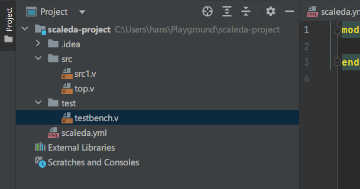
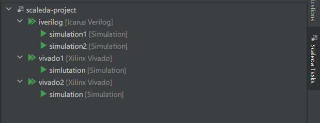

# Scaleda 项目系统介绍

此处的「Scaleda 项目」指采用 Scaleda 开发的 FPGA 项目。
一个 Scaleda 项目即是一个 FPGA 工程，包括一个或多个源文件、一个或多个约束文件、一个或多个 IP 核等，可以支持多种任务（如仿真、综合、实现等），可以在多种平台（如 Xilinx Vivado）上执行。

## 项目结构

### HDL 文件

HDL 文件是项目的核心。在一个 Scaleda 项目中，HDL 文件（目前仅支持 Verilog）分为两类——源码和测试文件。
源码指普通的 Verilog 模块，而测试文件对应 testbench。
一个项目可以有多个源码文件，也可以有多个测试文件。
默认情况下，源码放在项目下 src 文件夹中，而测试文件在 test 文件夹里。



### 目标平台

一个「目标平台」（target）对应着工具链的类型，如 Vivado 或 Icarus Verilog。
根据工具链类型的不同，目标平台还可能需要设置额外参数，如对于 Vivado 平台，就需要设置器件型号。
一个项目可以有多个目标平台，包括多个使用同一工具链的目标平台。

### 任务

一个「任务」（task）指在一个目标平台上的可以被执行的事件。
在 Scaleda 中，任务有如下四种类型：

- 仿真（simulation），执行此任务会使用指定的 testbench 模块运行行为仿真，并展示波形图供调试。
- 综合（synthesis），执行此任务会使用指定的顶层模块进行逻辑综合，生成电路对应的 EDIF 网表文件。
- 实现（implementation），执行此任务会使用输入的 EDIF 网表文件进行实现，生成对应器件的比特流文件。
- 编程（programming），执行此任务会将输入的比特流文件编程到 FPGA 硬件上。 

Scaleda Tasks 面板中会以树形结构，展示当前项目中已有的任务：



以上图为例，这一项目中有 3 个目标平台，目标平台「iverilog」使用 Icarus Verilog 工具链，目标平台「vivado1」和「vivado2」使用 Vivado 工具链，可能设置了不同的器件型号。
这些目标平台之下又有仿真、综合等任务，它们可以设置不同的顶层模块、测试文件、综合选项等。

## 项目文件

上述的项目信息被记录在项目文件夹下的 `scaleda.yml` 文件中。
`scaleda.yml` 文件是一个 YAML 格式的文本文件，可以使用任何文本编辑器打开。
Scaleda 会自动读取 `scaleda.yml` 文件中的信息，以构建项目系统。
在 Scaleda 中，可以使用图形化的界面编辑诸如任务、目标平台等信息，不需要直接编辑 `scaleda.yml` 文件。
`scaleda.yml` 文件也可以被用户直接编辑，以下是其文件结构

```yaml
---
name: 项目名称
description: 项目描述
version: 项目版本
author: 项目作者，以上三项非必需
type: rtl # 项目类型，目前仅支持 rtl
source: "src/" # 源码文件夹，所有 .v 文件都会被识别为源码文件
sources: [] # 源码文件列表，与 source 可一起使用，用来记录零散的源码文件
test: "test/" # 测试文件夹，所有 .v 文件都会被识别为测试文件
tests: [] # 测试文件列表，与 test 可一起使用，用来记录零散的测试文件
topModule: "top" # 项目的默认顶层模块，如果某个「目标平台」或者「任务」没有指定顶层模块，就会使用此处的默认值，可以不设置
constraints: "" # 约束文件目录，所有 .xdc 文件都会被识别为约束文件
targets: # 目标平台
```